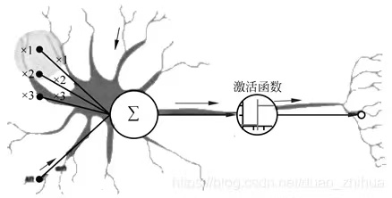

# 第 9 章 检测与分割实战项目

  - 9.1 语义分割
    - 9.1.1 [语义分割 PyTorch 版](https://github.com/Charmve/Semantic-Segmentation-PyTorch)
    - 9.1.2 实战项目 6 
  - 9.2 目标检测
    - 9.2.1 常用网络
    - 9.2.2 实战项目 7 
  - 9.3 实例分割 
    - 9.3.1 常用网络 
    - 9.3.2 实战项目 8
    - 9.3.3 新方法：滑动窗口, PointRend, PolarMask
  - 小结
  - 参考文献

# 9.3 实例分割

作者: 张伟 (Charmve)

日期: 2021/06/06

## 9.3.1 常用网络 

图9.1 神经元-激活函数

## 9.3.2 实战项目 8 

## 9.3.3 新方法：[滑动窗口](https://blog.csdn.net/Charmve/article/details/108915225), [PointRend](https://blog.csdn.net/Charmve/article/details/108892076), PolarMask

<table>
<tr>
	<td>1.</td>
	<td>

	</td>
	<td>
		
<b>PointRend</b>: Image Segmentation as Rendering
			 <b>Alexander Kirillov∗</b>, Yuxin Wu, Kaiming He, Ross Girshick
		

		

	         <b>Abstract</b>. We present a new method for efficient high-quality image segmentation of objects and scenes. By analogizing classical computer graphics methods for efficient rendering with over- and undersampling challenges faced in pixel labeling tasks, we develop a unique perspective of image segmentation as a rendering problem. From this vantage, we present the PointRend (Point-based Rendering) neural network module: a module that performs point-based segmentation predictions
		

  		    
Click to expand

			at adaptively selected locations based on an iterative subdivision algorithm. PointRend can be flexibly applied to both instance and semantic segmentation tasks by building on top of existing state-of-the-art models. While many concrete implementations of the general idea are possible, we show that a simple design already achieves excellent results. Qualitatively, PointRend outputs crisp object boundaries in regions that are over-smoothed by previous methods. Quantitatively, PointRend yields significant gains on COCO and Cityscapes, for both instance and semantic segmentation. PointRend's efficiency enables output resolutions that are otherwise impractical in terms of memory or computation compared to existing approaches. 
		

	        
	     	

		
 CVPR 2020
			 [<b><a href="https://arxiv.org/abs/1912.08193" target="_blank">arXiv</a></b> | <a href="https://www.youtube.com/watch?v=yvNZGDZC3F8" target="_blank"><b>Video</b></a>  | <a href="https://github.com/facebookresearch/detectron2/tree/master/projects" target="_blank"><b>Project</b></a> | <a href="https://github.com/facebookresearch/detectron2/tree/master/projects/PointRend" target="_blank"><b>Code</b></a>]
		

	</td>
</tr>
<tr>
	<td>2.</td>
	<td>

	</td>
	<td>
		
<b>PolarMask</b>: Single Shot Instance Segmentation with Polar Representation
			 <b>Enze Xie∗</b>, Peize Sun, Xiaoge Song, Wenhai Wang, Ding Liang, Chunhua Shen, Ping Luo
		

		

	         <b>Abstract</b>. In this paper, we introduce an anchor-box free and single shot instance segmentation method, which is conceptually simple, fully convolutional and can be used as a mask prediction module for instance segmentation, by easily embedding it into most off-the-shelf detection methods. Our method, termed PolarMask, formulates the instance segmentation problem as instance center classification and dense distance regression in a polar coordinate. Moreover, we propose two effective approaches to deal with sampling high-quality center examples and optimization for dense distance regression, respectively, which can significantly improve the performance and simplify the training process. 
		

  		    
Click to expand
Without any bells and whistles, PolarMask achieves 32.9% in mask mAP with single-model and single-scale training/testing on challenging COCO dataset. For the first time, we demonstrate a much simpler and flexible instance segmentation framework achieving competitive accuracy. We hope that the proposed PolarMask framework can serve as a fundamental and strong baseline for single shot instance segmentation tasks.
		

	        
	     	

		
 CVPR 2020
			 [<b><a href="https://arxiv.org/abs/1909.13226" target="_blank">arXiv</a></b> | <a href="https://www.youtube.com/watch?v=sysySMr3YN4" target="_blank"><b>Video</b></a> | <a href="https://github.com/xieenze/PolarMask" target="_blank"><b>Code</b></a>  | <a href="https://zhuanlan.zhihu.com/p/84890413" target="_blank"><b>Study</b></a>]
		

	</td>
</tr>
<tr>
	<td>3.</td>
	<td>

	</td>
	<td>
		
<b>End-to-end Animal Image Matting</b>
			 <b>Jizhizi Li∗</b>, Jing Zhang, Stephen J. Maybank, Dacheng Tao∗
		

		

	         <b>Abstract</b>. Extracting accurate foreground animals from natural animal images benefits many downstream applications such as film production and augmented reality. However, the various appearance and furry characteristics of animals challenge existing matting methods, which usually require extra user inputs such as trimap or scribbles. To resolve these problems, we study the distinct roles of semantics and details for image matting and decompose the task into two parallel sub-tasks: high-level semantic segmentation and low-level details matting. Specifically, we propose a novel Glance and Focus Matting network (GFM), which employs a shared encoder and two separate decoders to learn both tasks in a collaborative manner for end-to-end animal image matting. 
		

  		    
Click to expand
Besides, we establish a novel Animal Matting dataset (AM-2k) containing 2,000 high-resolution natural animal images from 20 categories along with manually labeled alpha mattes. Furthermore, we investigate the domain gap issue between composite images and natural images systematically by conducting comprehensive analyses of various discrepancies between foreground and background images. We find that a carefully designed composition route RSSN that aims to reduce the discrepancies can lead to a better model with remarkable generalization ability. Comprehensive empirical studies on AM-2k demonstrate that GFM outperforms state-of-the-art methods and effectively reduces the generalization error.
		

	        
	     	

		
 CVPR 2020
			 [<b><a href="https://arxiv.org/abs/2010.16188" target="_blank">arXiv</a></b> | <a href="https://github.com/JizhiziLi/animal-matting" target="_blank"><b>Project Page</b></a> |  <b>Video</b>  |  <a href="https://github.com/JizhiziLi/animal-matting" target="_blank"><b>Code</b></a> | <a href="https://arxiv.org/pdf/2009.06613.pdf" target="_blank"><b>Related Work</b>]
		

	</td>
</tr>
</table>
 
